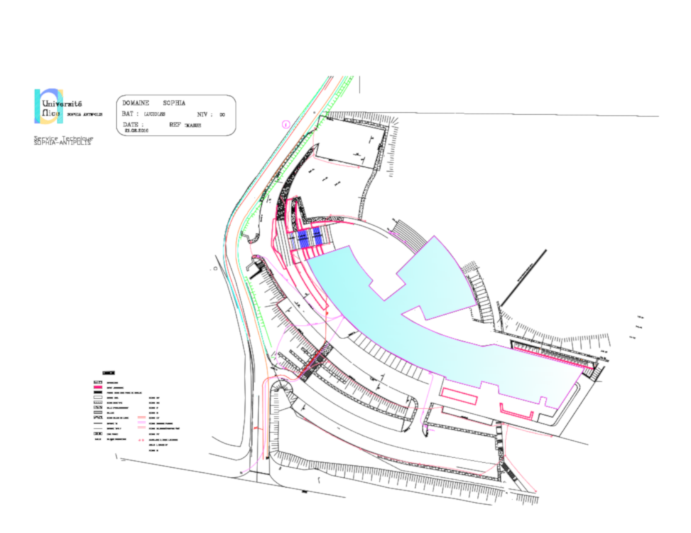
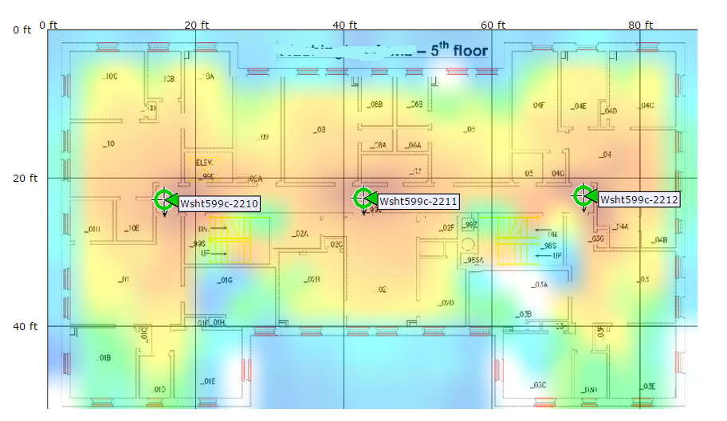
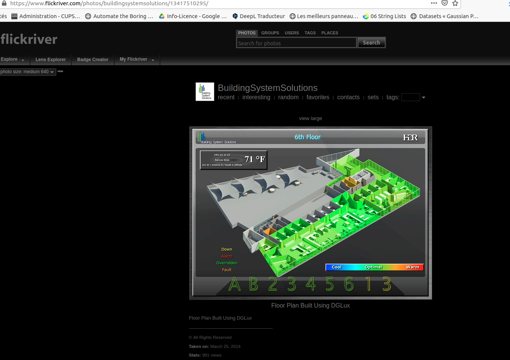

# building_mgmt

Le projet “Bâtiment intelligent” a pour objectif de construire un
outil de gestion des températures (et un peu plus) du batiment des
Lucioles.

## Dashboard

Il s'agit d'obtenir un dashboard visuable depuis une page Web.

Ce dashboard sera constitué d'une représentation du batiment
(étage+salles), sur laquelle on pourra "superposer" le "champ" de
températures relevées sur différentes points par les objets.

Ces objets munis de capteurs de temperature, hydrométrie, ... pourront
aussi être équipés d'une caméra qui permettra de streamer à des
fréquences plus ou moins rapides des images des salles et de leurs
occupants.

* Le dashboard permettra aussi de représenter un historique des
  valeurs mesurées : courbes/statistiques

* Le dashboard permettra de configurer/accéder aux statuts des objets.

Il y a d'autres projets qui vont avoir besoin d'une visualisation d'un
"champ de valeurs".  Sur ce point, une collaboration est possible =>
il vaut mieux un truc bien que plusieurs versions "pas glop" !

Voilà à quoi pourrait correspondre cette visualisation des
températures :

## Les objets
On peut utiliser ESP32 CAM

La programmation de ces objets devra utiliser OTA.

Ces objets peuvent émettre des notifications : température excessive
due à un incendie, lumière laissée allumée sans occupants, tentative
de vol de l'objet, ...

## Réseau

D'un point de vue des communications, on essayera de développer un
réseau MESH dans l'objectif de ne pas faire supporter le flux par le
réseau de l'UCA : on s'évitera ainsi des contraintes de sécurité. Ce
qui n'empêche pas de gérer correctement la sécurité du réseau "à notre
facon".

https://randomnerdtutorials.com/esp-mesh-esp32-esp8266-painlessmesh/

On essayera de mettre en place une démarche econome en énergie au
niveau de la programmation et de l'architecture.

On ne peut utiliser QUE DES SOLUTIONS libres de droit ( y compris
après la période d'essai)

Je préfère qu'une partie soit bien traitée
(dans son contexte) plutôt que d'obtenir un truc sans forme !

* Donc plutôt séquentialiser le traitement des difficultés ... quitte
  à ne pas toutes les traiter.
  

